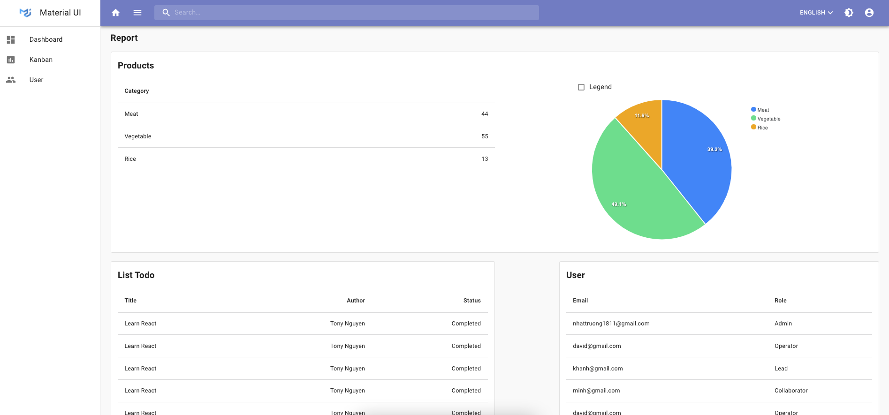
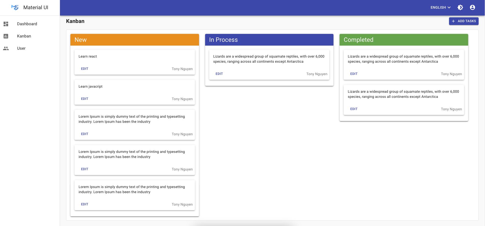

# REACT MATERIAL DASHBOARD COURSE

A simple project react apps built after finish course react front end.

## Working application

Check out the live application -> https://tender-montalcini-22dc6e.netlify.app/

### Dashboard



### Kanban



## Tech

- axios interceptor
- authenticate routes
- authorize user
- drag & drop
- infinite scroll
- dark mode
- multi languages

## API

```bash
# Get User, Todo, Photo
Api:       https://tony-json-server.herokuapp.com
Github:    https://github.com/nhattruongniit/tony-json-server

# Login, Register, Authenticate User
Api:       https://tony-auth-express.herokuapp.com
Github:    https://github.com/nhattruongniit/tony-auth-express

```
